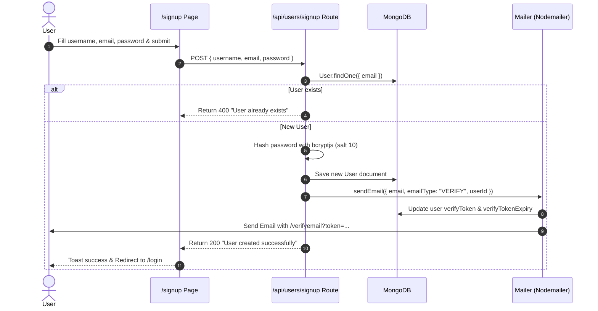
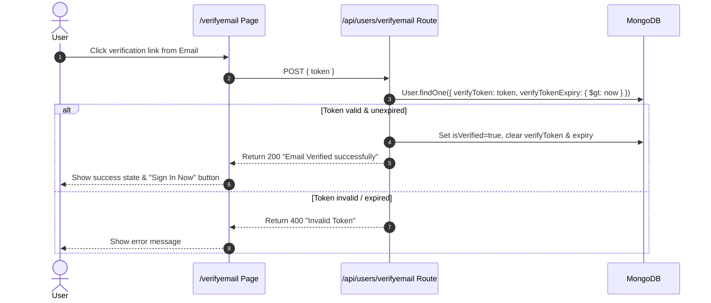
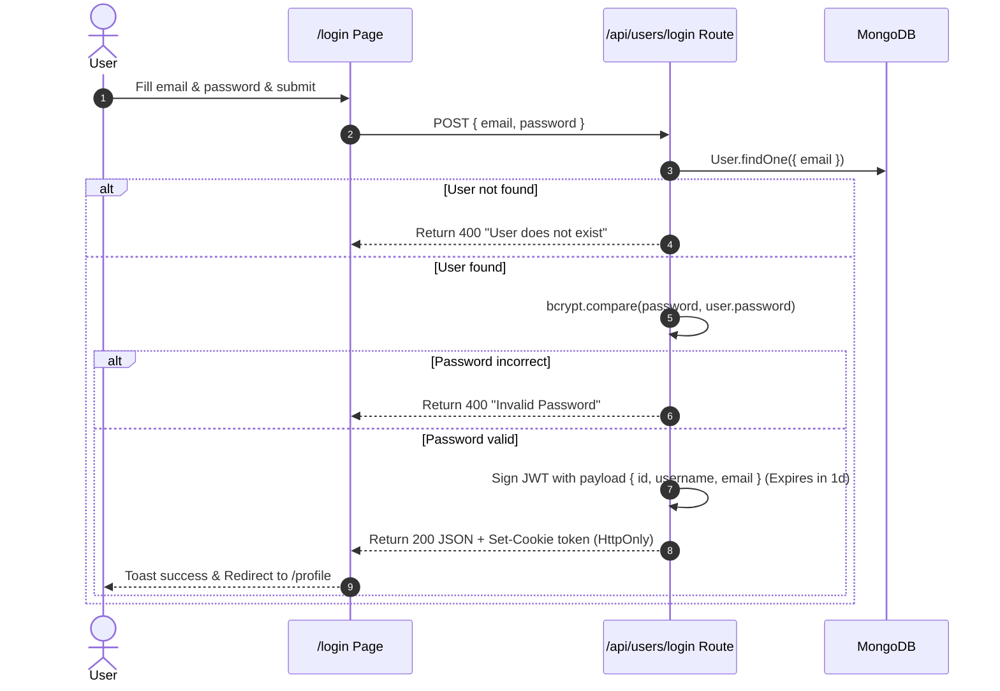
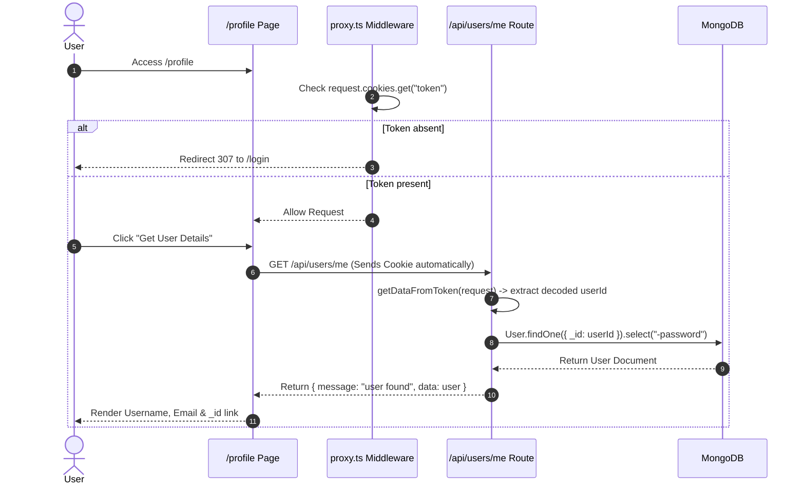
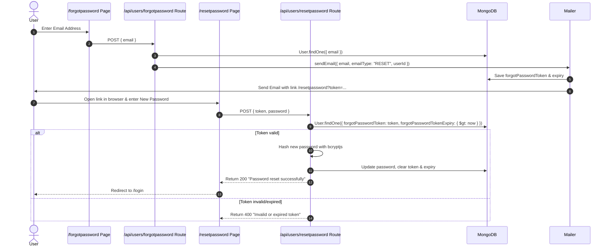

# 📘 AuthNext - Comprehensive Application Understanding & Revision Guide

Welcome to the comprehensive technical documentation for **AuthNext**, a full-stack user authentication platform built with **Next.js 16 (App Router)**, **MongoDB**, **Mongoose**, **JWT (JSON Web Tokens)**, and **Nodemailer**. 

This document is designed for quick revision, deep technical understanding, architecture analysis, and interview preparation.

---

## 📋 Table of Contents

1. [Project Overview & Capabilities](#-1-project-overview--capabilities)
2. [Tech Stack & Dependency Breakdown](#-2-tech-stack--dependency-breakdown)
3. [Application File & Directory Structure](#-3-application-file--directory-structure)
4. [Architecture & How the Stack Works Together](#-4-architecture--how-the-stack-works-together)
   - [Database Connection Layer](#41-database-connection-layer)
   - [User Data Model & Schema](#42-user-data-model--schema)
   - [Route Guard Middleware / Proxy](#43-route-guard-middleware--proxy)
   - [Token Verification & Extraction Helper](#44-token-verification--extraction-helper)
   - [Transactional Email Service](#45-transactional-email-service)
5. [End-to-End Functional Workflows](#-5-end-to-end-functional-workflows)
   - [1. User Registration & Email Verification Workflow](#1-user-registration--email-verification-workflow)
   - [2. User Login & HTTP-Only Cookie Session Workflow](#2-user-login--http-only-cookie-session-workflow)
   - [3. Protected Profile & Dashboard Flow](#3-protected-profile--dashboard-flow)
   - [4. Forgot Password & Reset Password Flow](#4-forgot-password--reset-password-flow)
   - [5. Logout Flow](#5-logout-flow)
6. [API Endpoints Reference](#-6-api-endpoints-reference)
7. [Frontend UI & Layout Structure](#-7-frontend-ui--layout-structure)
8. [Environment Variables Configuration](#-8-environment-variables-configuration)
9. [Quick Revision Cheat Sheet](#-9-quick-revision-cheat-sheet)

---

## 📌 1. Project Overview & Capabilities

**AuthNext** is a production-style, secure, full-stack Next.js web application implementing custom user authentication and identity management without third-party auth providers (like NextAuth or Clerk). 

### Key Capabilities:
- **User Registration**: Create accounts with username, email, and password. Passwords are securely hashed before DB insertion.
- **Email Verification**: Automates token generation and email dispatching via SMTP to verify newly registered user accounts.
- **Secure JWT Login**: Issues HTTP-Only cookies upon successful credential authentication to prevent XSS attacks.
- **Protected Middleware / Proxy Guard**: Automatically intercepts incoming page requests, redirecting unauthenticated users to `/login` and logged-in users away from auth pages to `/`.
- **User Dashboard & Profile**: Fetches token data securely from server endpoints to retrieve authenticated user session details (`_id`, `username`, `email`).
- **Dynamic Profile Routing**: View specific user profiles via dynamic route parameters (`/profile/[id]`).
- **Forgot / Reset Password Flow**: Handles secure token-based password reset links delivered via email.
- **Secure Logout**: Clears active session cookies instantly.

---

## 🛠️ 2. Tech Stack & Dependency Breakdown

The project leverages modern full-stack TypeScript/JavaScript libraries:

| Layer / Concern | Technology / Library | Purpose in this Project |
| :--- | :--- | :--- |
| **Framework** | **Next.js 16.2** (App Router) | Full-stack React framework providing App Router, Server APIs (`/api`), Middleware/Proxy, and Server Components. |
| **UI Library** | **React 19** / **React DOM 19** | Modern UI rendering library using Client Components (`"use client"`) and Server Components. |
| **Language** | **TypeScript 5** / JavaScript | Type safety for API handlers, helpers, and UI components. |
| **Database & ORM** | **MongoDB** + **Mongoose 9.8** | NoSQL Document database with Mongoose ODM for schema modeling and DB connection lifecycle management. |
| **Authentication** | **jsonwebtoken (JWT)** | Encodes and verifies secure JSON Web Tokens containing user payload data (`id`, `username`, `email`). |
| **Password Security** | **bcryptjs 3.0** | Hashes user passwords with salt rounds and hashes verification/reset tokens. |
| **Email Transporter** | **Nodemailer 9.0** | Sends transactional HTML emails for verification and password resets (configured with Mailtrap SMTP sandbox). |
| **HTTP Client** | **Axios 1.18** | Handles client-side API requests from React components to `/api/users/*`. |
| **UI Notifications** | **React Hot Toast 2.6** | Displays minimal, responsive toast notifications for success and error states. |
| **Icons & Styling** | **Lucide React** + **Tailwind CSS 4** | Clean minimalist dark-mode UI with modern iconography. |

---

## 📁 3. Application File & Directory Structure

```
auth-app/
├── package.json                   # Project dependencies and npm scripts
├── tsconfig.json                  # TypeScript compiler settings
├── next.config.ts                 # Next.js runtime configuration
├── eslint.config.mjs              # ESLint configuration
├── postcss.config.mjs             # PostCSS setup for Tailwind CSS v4
├── .env                           # Environment secret keys (MONGO_URI, JWT_SECRET_KEY, etc.)
└── src/
    ├── proxy.ts                   # Route protection middleware / proxy handler
    ├── dbConfig/
    │   └── dbConfig.ts            # Mongoose MongoDB connection helper
    ├── model/
    │   └── userModel.js           # User schema definition & Mongoose model export
    ├── helper/
    │   ├── getDataFromToken.ts    # Extracts and verifies user ID from HTTP-only JWT cookie
    │   └── mailer.ts              # Transports email (VERIFY / RESET) & updates DB tokens
    ├── components/
    │   ├── Navbar.tsx             # Top navigation bar with active route highlighting
    │   └── Footer.tsx             # Sticky footer component
    └── app/
        ├── layout.tsx             # Root layout wrapping pages with fonts, Toast container, Navbar & Footer
        ├── globals.css            # Custom CSS styling tokens & Tailwind imports
        ├── page.tsx               # Homepage ("/")
        ├── login/
        │   └── page.tsx           # Sign-in page
        ├── signup/
        │   └── page.tsx           # User account creation page
        ├── profile/
        │   ├── page.tsx           # Protected User Dashboard
        │   └── [id]/
        │       └── page.tsx       # Dynamic User Profile Page (`/profile/:id`)
        ├── verifyemail/
        │   └── page.tsx           # Email token verification client page (`/verifyemail?token=...`)
        ├── forgotpassword/
        │   └── page.tsx           # Forgot password email request page
        ├── resetpassword/
        │   └── page.tsx           # New password submission page (`/resetpassword?token=...`)
        └── api/
            └── users/             # Server API endpoints (Next.js Route Handlers)
                ├── signup/
                │   └── route.ts   # POST: Register user & send verification email
                ├── login/
                │   └── route.ts   # POST: Authenticate credentials & set token cookie
                ├── logout/
                │   └── route.ts   # GET: Clear authentication token cookie
                ├── me/
                │   └── route.ts   # GET: Fetch authenticated user details via JWT token
                ├── verifyemail/
                │   └── route.ts   # POST: Validate email verification token & update user flag
                ├── forgotpassword/
                │   └── route.ts   # POST: Validate email & send password reset email
                └── resetpassword/
                    └── route.ts   # POST: Validate reset token & update user password
```

---

## ⚙️ 4. Architecture & How the Stack Works Together

### 4.1 Database Connection Layer
📄 **File**: [dbConfig.ts](file:///c:/Users/PRITISH%20KUMAR%20SHARMA/Documents/Code/Developer/NextJs/auth-app/src/dbConfig/dbConfig.ts)

Next.js route handlers run in a serverless/edge context. The `connect()` function connects Mongoose to MongoDB using `process.env.MONGO_URI`:
- Subscribes to Mongoose `connection.on('connected')` and `connection.on('error')` events.
- Ensures DB connection is maintained or reused across API calls.

---

### 4.2 User Data Model & Schema
📄 **File**: [userModel.js](file:///c:/Users/PRITISH%20KUMAR%20SHARMA/Documents/Code/Developer/NextJs/auth-app/src/model/userModel.js)

Defines the Mongoose Schema for the `users` collection:
```javascript
{
  username: { type: String, required: true, unique: true },
  email:    { type: String, required: true, unique: true },
  password: { type: String, required: true },
  isVerified: { type: Boolean, default: false },
  isAdmin:    { type: Boolean, default: false },
  forgotPasswordToken: String,
  forgotPasswordTokenExpiry: Date,
  verifyToken: String,
  verifyTokenExpiry: Date
}
```
*Note*: `mongoose.models.users || mongoose.model("users", userSchema)` prevents Mongoose overwrite model error during Next.js hot module reloads (HMR).

---

### 4.3 Route Guard Middleware / Proxy
📄 **File**: [proxy.ts](file:///c:/Users/PRITISH%20KUMAR%20SHARMA/Documents/Code/Developer/NextJs/auth-app/src/proxy.ts)

Intercepts incoming requests matched by `config.matcher`:
- **Public Paths**: `/login`, `/signup`, `/verifyemail`, `/forgotpassword`, `/resetpassword`
- **Protected Paths**: `/`, `/profile`, `/profile/:path*`
- **Behavior**:
  - If a user attempts to access a **public path** with an active `token` cookie, they are redirected to `/`.
  - If a user attempts to access a **protected path** without a `token` cookie, they are redirected to `/login`.

---

### 4.4 Token Verification & Extraction Helper
📄 **File**: [getDataFromToken.ts](file:///c:/Users/PRITISH%20KUMAR%20SHARMA/Documents/Code/Developer/NextJs/auth-app/src/helper/getDataFromToken.ts)

Extracted helper function used inside authenticated API routes (such as `/api/users/me`):
1. Reads `request.cookies.get("token")?.value`.
2. Verifies the JWT signature against `process.env.JWT_SECRET_KEY`.
3. Returns the decoded `user.id`.

---

### 4.5 Transactional Email Service
📄 **File**: [mailer.ts](file:///c:/Users/PRITISH%20KUMAR%20SHARMA/Documents/Code/Developer/NextJs/auth-app/src/helper/mailer.ts)

Handles sending verification and reset emails:
1. Generates a secure hashed token by hashing `userId.toString()` using `bcryptjs.hash()`.
2. Based on `emailType`:
   - `"VERIFY"`: Updates user with `verifyToken` and `verifyTokenExpiry` (current time + 1 hour / 3600000ms).
   - `"RESET"`: Updates user with `forgotPasswordToken` and `forgotPasswordTokenExpiry` (current time + 1 hour).
3. Constructs standard Nodemailer transport targeting Mailtrap sandbox SMTP server (`sandbox.smtp.mailtrap.io:2525`).
4. Generates dynamic verification/reset URL (`${DOMAIN}/verifyemail?token=${hashedToken}` or `${DOMAIN}/resetpassword?token=${hashedToken}`).
5. Dispatches HTML formatted email to user's address.

---

## 🔄 5. End-to-End Functional Workflows

### 1. User Registration & Email Verification Workflow




---

### 2. User Login & HTTP-Only Cookie Session Workflow


---

### 3. Protected Profile & Dashboard Flow


---

### 4. Forgot Password & Reset Password Flow


---

### 5. Logout Flow
1. User clicks **"Sign Out"** on `/profile`.
2. Frontend calls `GET /api/users/logout`.
3. Server returns response with `token=""` cookie expired (`expires: new Date(0)`).
4. Frontend redirects user to `/login`.

---

## 🔌 6. API Endpoints Reference

| Route Path | HTTP Method | Protected? | Request Body / Query | Description |
| :--- | :---: | :---: | :--- | :--- |
| [`/api/users/signup`](file:///c:/Users/PRITISH%20KUMAR%20SHARMA/Documents/Code/Developer/NextJs/auth-app/src/app/api/users/signup/route.ts) | `POST` | ❌ No | `{ username, email, password }` | Creates user, hashes password, triggers email verification dispatch. |
| [`/api/users/login`](file:///c:/Users/PRITISH%20KUMAR%20SHARMA/Documents/Code/Developer/NextJs/auth-app/src/app/api/users/login/route.ts) | `POST` | ❌ No | `{ email, password }` | Authenticates credentials, signs JWT, sets `httpOnly` cookie. |
| [`/api/users/logout`](file:///c:/Users/PRITISH%20KUMAR%20SHARMA/Documents/Code/Developer/NextJs/auth-app/src/app/api/users/logout/route.ts) | `GET` | 🔒 Yes | None | Clears session cookie (`token=""`, `expires: 1970`). |
| [`/api/users/me`](file:///c:/Users/PRITISH%20KUMAR%20SHARMA/Documents/Code/Developer/NextJs/auth-app/src/app/api/users/me/route.ts) | `GET` | 🔒 Yes | None (Extracts token from Cookie) | Returns authenticated user details (excluding password). |
| [`/api/users/verifyemail`](file:///c:/Users/PRITISH%20KUMAR%20SHARMA/Documents/Code/Developer/NextJs/auth-app/src/app/api/users/verifyemail/route.ts) | `POST` | ❌ No | `{ token }` | Verifies account verification token and updates `isVerified=true`. |
| [`/api/users/forgotpassword`](file:///c:/Users/PRITISH%20KUMAR%20SHARMA/Documents/Code/Developer/NextJs/auth-app/src/app/api/users/forgotpassword/route.ts) | `POST` | ❌ No | `{ email }` | Checks email existence and sends password reset link. |
| [`/api/users/resetpassword`](file:///c:/Users/PRITISH%20KUMAR%20SHARMA/Documents/Code/Developer/NextJs/auth-app/src/app/api/users/resetpassword/route.ts) | `POST` | ❌ No | `{ token, password }` | Validates reset token and sets new hashed password in DB. |

---

## 🌐 7. Frontend UI & Layout Structure

### Components & Layouts
- **[RootLayout](file:///c:/Users/PRITISH%20KUMAR%20SHARMA/Documents/Code/Developer/NextJs/auth-app/src/app/layout.tsx)**: Centers content within a minimalist card shell (`max-w-xl`), injects `Geist` typography, renders [Navbar](file:///c:/Users/PRITISH%20KUMAR%20SHARMA/Documents/Code/Developer/NextJs/auth-app/src/components/Navbar.tsx) and [Footer](file:///c:/Users/PRITISH%20KUMAR%20SHARMA/Documents/Code/Developer/NextJs/auth-app/src/components/Footer.tsx), and mounts `react-hot-toast` toaster container.
- **[Navbar](file:///c:/Users/PRITISH%20KUMAR%20SHARMA/Documents/Code/Developer/NextJs/auth-app/src/components/Navbar.tsx)**: Client Component using `usePathname()` to dynamically highlight active navigation tabs (Home, Profile, Login, Sign Up).
- **[ResetPasswordPage](file:///c:/Users/PRITISH%20KUMAR%20SHARMA/Documents/Code/Developer/NextJs/auth-app/src/app/resetpassword/page.tsx)**: Wrapped in React `<Suspense>` boundary to safely handle Next.js client-side search params reading (`useSearchParams()`).

---

## 🗝️ 8. Environment Variables Configuration

The application expects a `.env` file in the root directory:

```env
MONGO_URI=mongodb+srv://<username>:<password>@cluster.mongodb.net/authapp?retryWrites=true&w=majority
JWT_SECRET_KEY=your_super_secret_jwt_key
USER=your_mailtrap_smtp_user
PASSWORD=your_mailtrap_smtp_password
DOMAIN=http://localhost:3000
```

---

## 🚀 9. Quick Revision Cheat Sheet

1. **Why `httpOnly: true` on Cookie?**
   - Setting `httpOnly: true` prevents client-side JavaScript (`document.cookie`) from accessing the JWT token, protecting against Cross-Site Scripting (XSS) attacks.

2. **Why `mongoose.models.users || mongoose.model("users", userSchema)`?**
   - In Next.js serverless architecture and development HMR mode, files are re-evaluated frequently. This pattern prevents Mongoose from throwing `OverwriteModelError`.

3. **How does Route Guard Middleware (`proxy.ts`) protect pages?**
   - `proxy.ts` runs on the server before a page request completes. It reads the cookie header, checks if a token exists, and returns a `NextResponse.redirect()` if an unauthenticated user tries to access protected routes like `/profile`.

4. **Why is `select("-password")` used in `/api/users/me`?**
   - Security best practice to ensure hashed password strings are never returned in JSON API responses to the frontend.

5. **How does token expiration work for email verification / password reset?**
   - MongoDB queries enforce token expiry: `{ verifyTokenExpiry: { $gt: Date.now() } }`. If the current time exceeds `verifyTokenExpiry`, the query returns `null`, invalidating the token.

---

*AuthNext Architecture Documentation generated for revision.*
